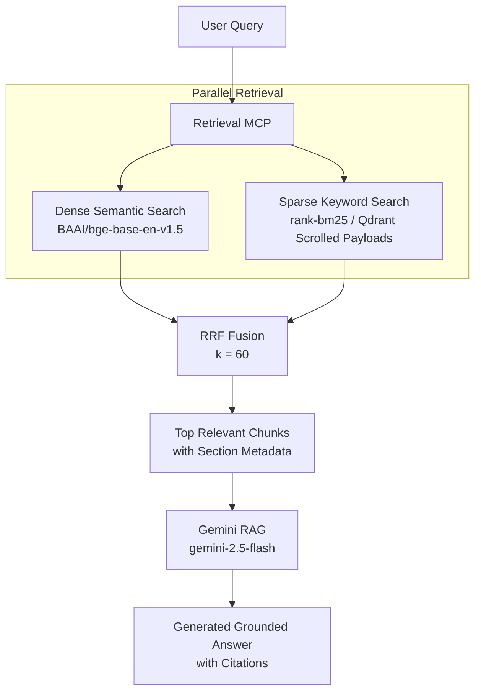
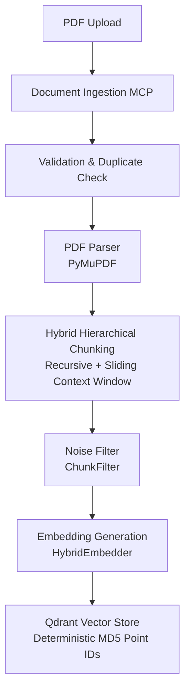

# Hybrid PDF + OCR Retrieval Pipeline with MCP

A modular, production-grade Retrieval-Augmented Generation (RAG) system built for complex enterprise documents. It orchestrates layout-aware PDF parsing, hybrid hierarchical chunking, dense/sparse retrieval, and Gemini-based answer generation using the Model Context Protocol (MCP).

---

## Current Status

* Phase 1: PDF Parser MCP                    ✅ (Completed)
* Phase 2: Chunking Pipeline                 ✅ (Completed)
* Phase 3: Embedding Pipeline                ✅ (Completed)
* Phase 4: Qdrant Integration                ✅ (Completed)
* Phase 5: Document Ingestion MCP            ✅ (Completed)
* Phase 6: Retrieval MCP                     ✅ (Completed)
* Phase 7: Gemini RAG                        ✅ (Completed)
* Phase 8: Document Filtering                ✅ (Completed)
* Phase 9: Duplicate Protection              ✅ (Completed)
* Phase 10: Hybrid Retrieval (Dense + BM25)  ✅ (Completed)
* Phase 11: Reranking                        🚧 (Planned)
* Phase 12: OCR MCP                          🚧 (Planned)
* Phase 13: Table Extraction MCP             🚧 (Planned)
* Phase 14: Layout Analysis MCP              🚧 (Planned)

Current Release Version: **RAG V1.0 (Hybrid Retrieval Enabled)**

---

## Problem Statement

Traditional RAG pipelines struggle with real-world enterprise documents, often failing due to:
* **Multi-column layouts** resulting in out-of-order text extraction.
* **Tables and charts** losing their spatial representation.
* **Scanned/low-quality PDFs** requiring OCR integration.
* **Structural Noise** (headers, footers, page numbers) polluting semantic embeddings.
* **Keyword vs. Semantic Mismatches** where exact terms/acronyms are missed by dense models, or conceptual themes are missed by keyword-based matchers.

This pipeline preserves layout structure, filters out structural noise, supports metadata-scoped filtering, and implements hybrid retrieval with Reciprocal Rank Fusion (RRF) to retrieve the most contextually relevant chunks.

---

## System Architecture

### Query & Retrieval Flow
The retrieval server performs hybrid retrieval by executing semantic search and BM25 search in parallel, then fuses the results using Reciprocal Rank Fusion (RRF).



### Document Ingestion Flow
Documents go through layouts extraction, page-by-page hybrid chunking, embedding, and deterministic upserting.



---

## Key Features & Capabilities

### 1. Advanced Ingestion & Layout-Aware Parsing
* **Layout Parsing**: Extracts metadata, total pages, and text hierarchy.
* **Hybrid Hierarchical Chunking**:
  * Chunks text section-by-section using structural heading detection (`r"(\d+(?:\.\d+)?\s+.+)"`).
  * Generates **base chunks** (RecursiveCharacterTextSplitter) alongside **context chunks** (sliding window merging adjacent chunks to preserve context).
* **Noise Filtering**: Automatically discards headers, footers, "Table of Contents", and short blocks (< 50 chars).

### 2. Dual-Engine Retrieval & Fusion
* **Dense Semantic Retrieval**: Employs `BAAI/bge-base-en-v1.5` embeddings (768-dimensional, Cosine distance) to capture conceptual similarity.
* **Sparse Keyword Retrieval**: Employs `BM25Okapi` over local text documents scrolled from Qdrant payloads to match exact acronyms and keywords.
* **Reciprocal Rank Fusion (RRF)**: Merges dense and sparse rankings using reciprocal scoring ($Score = \sum \frac{1}{k + Rank}$) to ensure optimal ranking.

### 3. Reliability & Deduplication
* **Content-Based Point IDs**: Point IDs are generated using an MD5 hash of `document_name + page + chunk_text`. This guarantees that duplicate chunks do not create redundant database entries.
* **Ingestion Guard**: Skips processing if the document has already been indexed.

---

## Retrieval MCP Tools

The **Retrieval MCP** exposes the following endpoints for client orchestration:

| Tool Name | Parameters | Description |
|-----------|------------|-------------|
| `semantic_search` | `query: str`, `top_k: int`, `document_name: str` | Perform semantic (dense) search in the Qdrant vector store. |
| `bm25_search` | `query: str`, `top_k: int` | Perform BM25 keyword (sparse) search over the indexed documents. |
| `hybrid_search` | `query: str`, `top_k: int`, `document_name: str` | Perform hybrid (dense + BM25) search with RRF fusion. |
| `ask_documents` | `query: str`, `top_k: int`, `document_name: str` | RAG tool using Gemini to answer queries strictly based on fused retrieval contexts. |
| `ingest_document` | `file_path: str` | Validate and ingest a local PDF/TXT/MD document into the Qdrant database. |
| `list_documents` | None | Retrieve the list of all document names currently indexed in the vector store. |
| `get_collection_stats`| None | Fetch statistics (points count, vector size, distance metric) of the Qdrant collection. |

---

## Getting Started

### Prerequisites
* Python >= 3.11
* [uv](https://github.com/astral-sh/uv) (fast Python package installer and runner)
* Qdrant (running locally on `localhost:6333` or Docker)
* Google Gemini API Key

### Configuration
1. Clone this repository.
2. Create a `.env` file in the root directory:
   ```env
   GEMINI_API_KEY="your_gemini_api_key_here"
   ```

### Quick Setup

1. **Install Dependencies**:
   ```bash
   uv sync
   ```

2. **Start Qdrant**:
   Ensure Qdrant is running. If using Docker:
   ```bash
   docker run -p 6333:6333 -p 6334:6334 -v qdrant_storage:/qdrant/storage qdrant/qdrant
   ```

3. **Initialize the Collection**:
   Create the Qdrant `documents` collection with the correct vector dimensions (768):
   ```bash
   uv run python tests/test_create_collection.py
   ```

4. **Ingest Sample Documents**:
   Ingest a test PDF file to populate the index:
   ```bash
   uv run python tests/test_pipeline.py
   ```

---

## Running the MCP Servers

You can start the MCP servers locally using `uv`:

### PDF Parser MCP Server
```bash
uv run python -m mcp_servers.pdf_parser.server
```

### Retrieval MCP Server
```bash
uv run python -m mcp_servers.retrieval.server
```

*(You can register these servers in your cursor/VS Code settings or MCP host configuration using the absolute path to `uv` and the script module arguments.)*

---

## Verification & Testing Suite

We provide a comprehensive list of tests under the `tests/` directory to verify every component of the RAG pipeline:

```bash
# Verify basic connection & setup
uv run python tests/test_qdrant_connection.py  # Check connection to Qdrant
uv run python tests/test_gemini.py             # Check Gemini connection & credentials

# Verify embedding & chunking mechanics
uv run python tests/test_chunking.py           # Test recursive + sliding context chunking
uv run python tests/test_embeddings.py         # Test BGE-embedding generation

# Verify ingestion and stats
uv run python tests/test_pipeline.py           # Ingest a PDF through layout parser, chunker, & embedder
uv run python tests/test_document_counts.py    # Group and count points by document
uv run python tests/test_scroll_points.py      # Scroll and preview ingested payloads

# Verify search algorithms
uv run python tests/test_retrieval.py          # Test Dense semantic search
uv run python tests/test_bm25.py               # Test Sparse keyword BM25 search
uv run python tests/test_hybrid_retrieval.py   # Compare Dense, BM25, and Hybrid results
uv run python tests/test_document_filter.py    # Semantic search with metadata filtering

# Verify end-to-end QA
uv run python tests/test_rag.py                # Test grounded Gemini answer generation
```

---

## Project Structure

```text
hybrid-rag-mcp/
├── agent/                  # Future agentic logic (graph-based routing)
│   └── graph.py
├── app/                    # Configuration settings
│   ├── config.py
│   └── settings.py
├── data/                   # Directory to hold local files (e.g. data/samples/sample.pdf)
├── docs/                   # Upgrade logs and design documents
│   └── HYBRID_RAG_UPGRADE.md
├── embeddings/             # Text embedding utilities (Sentence Transformers)
│   └── embedder.py
├── ingestion/              # PDF extraction, chunking, filtering, and pipeline coordination
│   ├── chunker.py
│   ├── filters.py
│   ├── ingestion_service.py
│   └── pipeline.py
├── llm/                    # Gemini API interface client
│   └── gemini_client.py
├── mcp_servers/            # Model Context Protocol servers
│   ├── pdf_parser/         # PyMuPDF-based text parser & metadata extractor
│   │   ├── pdf_utils.py
│   │   ├── schemas.py
│   │   ├── tools.py
│   │   └── server.py
│   ├── retrieval/          # Retrieval server (semantic, bm25, hybrid, RAG, ingestion)
│   │   ├── bm25_qdrant_retriever.py
│   │   ├── bm25_retriever.py
│   │   ├── hybrid_retriever.py
│   │   ├── rag_engine.py
│   │   ├── retrieval_engine.py
│   │   ├── schemas.py
│   │   ├── tools.py
│   │   └── server.py
│   ├── ocr/                # Placeholder for scanned pages OCR (planned)
│   ├── table_extractor/    # Placeholder for table structures extractor (planned)
│   ├── layout_analyzer/    # Placeholder for layout extraction server (planned)
│   └── vector_store/       # Placeholder for standalone vector store controls (planned)
├── vector_store/           # Qdrant client connections, ingestion, & schema creations
│   ├── collections.py
│   ├── ingest.py
│   └── qdrant_client.py
├── tests/                  # Integration and verification test scripts
├── pyproject.toml          # PEP 621 configuration file & dependencies list
└── uv.lock                 # Lockfile for precise dependency resolution
```

---

## Technology Stack

* **Language**: Python >= 3.11
* **Orchestration**: Model Context Protocol (FastMCP)
* **Vector Database**: Qdrant (using Cosine distance, scrolling, payloads)
* **Embedding Model**: `BAAI/bge-base-en-v1.5` via Sentence Transformers
* **Sparse Index**: `BM25Okapi` via `rank-bm25`
* **RAG LLM**: Google Gemini SDK (`gemini-2.5-flash`)
* **Parsing**: PyMuPDF (`fitz`)
* **Environment**: `uv` package manager, `python-dotenv`