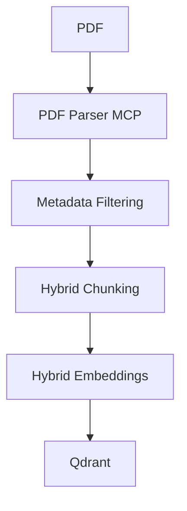
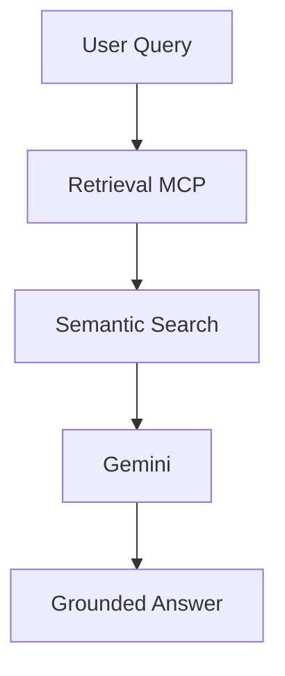

# Hybrid PDF + OCR Retrieval Pipeline with MCP

## Overview

Hybrid PDF + OCR Retrieval Pipeline with MCP is a modular Retrieval-Augmented Generation (RAG) system built for complex enterprise documents. It combines PDF parsing, hybrid chunking, embeddings, vector storage, and MCP orchestration to deliver grounded answers with citations.

---

## Problem Statement

Traditional RAG pipelines work well on clean PDFs but fail on real-world documents with:

* Multi-column layouts
* Tables and charts
* Scanned pages
* Headers, footers, and footnotes
* Mixed document structures

This project builds a document intelligence pipeline that preserves structure, reduces noise, and improves retrieval quality.

---

## Objectives

* Build a layout-aware ingestion pipeline
* Support digital and scanned PDFs
* Preserve document hierarchy and metadata
* Store embeddings in Qdrant
* Provide MCP-based tool orchestration
* Enable grounded question answering

---

## Project Status

Completed Modules:

* PDF Parser MCP
* Hybrid Chunking
* Hybrid Embeddings
* Qdrant Vector Store
* Ingestion Pipeline
* Retrieval Engine
* Retrieval MCP
* Gemini-Powered RAG

---

## Architecture

### Ingestion Flow



### Query Flow



---

## MCP Servers

### PDF Parser MCP

* Extracts metadata, page text, and document text.

### Retrieval MCP

* `semantic_search`
* `get_collection_stats`
* `list_documents`
* `ask_documents`

### Planned MCP Servers

* OCR MCP
* Table Extraction MCP
* Layout Analysis MCP
* Vector Store MCP

---

## Roadmap

```text
Phase 1  - PDF Parser MCP         DONE
Phase 2  - Hybrid Chunking        DONE
Phase 3  - Hybrid Embeddings      DONE
Phase 4  - Qdrant Integration     DONE
Phase 5  - Ingestion Pipeline     DONE
Phase 6  - Retrieval MCP          DONE
Phase 7  - Gemini RAG             DONE
Phase 8  - Document Ingestion MCP NEXT
Phase 9  - OCR MCP                NEXT
Phase 10 - Table Extraction MCP   NEXT
Phase 11 - Layout Analysis MCP    NEXT
Phase 12 - Hybrid Retrieval       NEXT
Phase 13 - Reranking              NEXT
```

---

## Key Capabilities

* Hybrid chunking with context windows
* Metadata filtering for noisy chunks
* Sentence-transformer embeddings
* Qdrant vector search
* Gemini-powered grounded answers
* MCP orchestration for modular services

---

## Project Structure

```text
hybrid-rag-mcp/

├── agent/
├── app/
├── embeddings/
├── ingestion/
├── llm/
├── mcp_servers/
│   ├── pdf_parser/
│   ├── retrieval/
│   ├── ocr/
│   ├── table_extractor/
│   ├── layout_analyzer/
│   └── vector_store/
├── vector_store/
├── data/
├── tests/
└── main.py
```

---

## Verification

Quick checks:

```bash
uv run python tests/test_chunking.py
uv run python tests/test_embeddings.py
uv run python tests/test_pipeline.py
uv run python tests/test_retrieval.py
uv run python tests/test_rag.py
```

---

## Future Enhancements

Not yet implemented:

* Document Ingestion MCP
* OCR MCP
* Table Extraction MCP
* Layout Analysis MCP
* Hybrid Retrieval
* Reranking

---

## Technology Stack

* Python
* MCP (FastMCP)
* Qdrant
* PyMuPDF
* Sentence Transformers
* Gemini SDK
