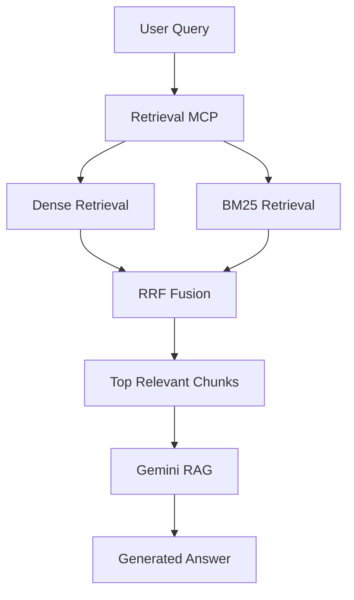
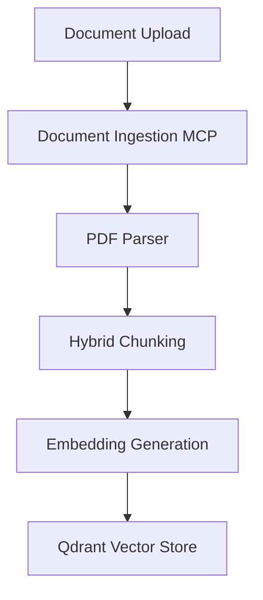

# Hybrid PDF + OCR Retrieval Pipeline with MCP

## Overview

Hybrid PDF + OCR Retrieval Pipeline with MCP is a modular Retrieval-Augmented Generation (RAG) system built for complex enterprise documents. It combines PDF parsing, hybrid chunking, embeddings, vector storage, and MCP orchestration to deliver grounded answers with citations.

---

## Current Status

* Phase 1: PDF Parser MCP                    ✅
* Phase 2: Chunking Pipeline                 ✅
* Phase 3: Embedding Pipeline                ✅
* Phase 4: Qdrant Integration                ✅
* Phase 5: Document Ingestion MCP            ✅
* Phase 6: Retrieval MCP                     ✅
* Phase 7: Gemini RAG                        ✅
* Phase 8: Document Filtering                ✅
* Phase 9: Duplicate Protection              ✅

Current Focus: Hybrid Retrieval (BM25 + Dense Search)

---

## Problem Statement

Traditional RAG pipelines work well on clean PDFs but fail on real-world documents with:

* Multi-column layouts
* Tables and charts
* Scanned pages
* Headers, footers, and footnotes
* Mixed document structures

This project builds a document intelligence pipeline that preserves structure, reduces noise, and improves retrieval quality.

---

## Objectives

* Build a layout-aware ingestion pipeline
* Support digital and scanned PDFs
* Preserve document hierarchy and metadata
* Store embeddings in Qdrant
* Provide MCP-based tool orchestration
* Enable grounded question answering

---

## Architecture

### Visual Flow

#### Query Flow



#### Ingestion Flow



### Text Flow

```
User Query
    |
    v
Retrieval MCP
    |
    v
Dense Retrieval (Embeddings + Qdrant)
    +
BM25 Keyword Retrieval
    |
    v
Reciprocal Rank Fusion (RRF)
    |
    v
Top Relevant Chunks
    |
    v
Gemini RAG
    |
    v
Generated Answer

Document Upload
    |
    v
Document Ingestion MCP
    |
    v
PDF Parser
    |
    v
Hybrid Chunking
    |
    v
Embedding Generation
    |
    v
Qdrant Vector Store
```

---

## Features

### PDF Processing
- PDF Parsing
- Metadata Extraction
- Page-Level Processing

### Ingestion Pipeline
- Dynamic PDF Upload
- Automatic Chunking
- Embedding Generation
- Qdrant Storage
- Section Metadata

### Retrieval
- Semantic Search
- BM25 Keyword Search
- Metadata Filtering
- Document-Level Search
- Multi-Document Search
- Section-Aware Results

### RAG
- Gemini-Powered Answers
- Context-Aware Responses
- Source-Based Retrieval

### Reliability
- Deterministic Qdrant IDs
- Duplicate Chunk Prevention
- Duplicate Document Prevention

---

## Retrieval MCP Tools

| Tool | Description |
|--------|------------|
| semantic_search | Search relevant chunks |
| ask_documents | Gemini-powered RAG |
| ingest_document | Ingest new PDFs |
| list_documents | List indexed documents |
| get_collection_stats | Collection statistics |

---

## Document Ingestion Workflow

```text
PDF
 ↓
Document Validation
 ↓
Duplicate Check
 ↓
PDF Parsing
 ↓
Chunking
 ↓
Embedding Generation
 ↓
Qdrant Upsert
```

---

## Duplicate Protection

The ingestion pipeline prevents duplicate documents and duplicate chunks using:

1. Content-Based Point IDs
2. Document Existence Checks

### Point ID Strategy

```text
MD5(
    document_name +
    page +
    chunk_text
)
```

This guarantees identical chunks map to identical Qdrant point IDs.

---

## Supported Workflows

### Single Document QA

```text
User
 ↓
Document Filter
 ↓
Semantic Search
 ↓
Gemini
```

### Multi Document QA

```text
User
 ↓
Knowledge Base Search
 ↓
Semantic Search
 ↓
Gemini
```

### Dynamic Document Upload

```text
New PDF
 ↓
ingest_document
 ↓
Qdrant
 ↓
Immediately Searchable
```

---

## MCP Servers

### PDF Parser MCP

* Extracts metadata, page text, and document text.

### Retrieval MCP (V3)

* `semantic_search`
* `get_collection_stats`
* `list_documents`
* `ask_documents`
* `ingest_document`

### Planned MCP Servers

* OCR MCP
* Table Extraction MCP
* Layout Analysis MCP
* Vector Store MCP

---

## Roadmap

```text
Phase 1  - PDF Parser MCP          DONE
Phase 2  - Hybrid Chunking         DONE
Phase 3  - Hybrid Embeddings       DONE
Phase 4  - Qdrant Integration      DONE
Phase 5  - Document Ingestion MCP  DONE
Phase 6  - Retrieval MCP           DONE
Phase 7  - Gemini RAG              DONE
Phase 8  - Document Filtering      DONE
Phase 9  - Duplicate Protection    DONE
Phase 10 - Hybrid Retrieval        PENDING
Phase 11 - Reranking               PENDING
Phase 12 - OCR MCP                 PENDING
Phase 13 - Table Extraction MCP    PENDING
Phase 14 - Layout Analysis MCP     PENDING
```

---

## Key Capabilities

* Hybrid chunking with context windows
* Metadata filtering for noisy chunks
* Sentence-transformer embeddings
* Qdrant vector search
* Gemini-powered grounded answers
* MCP orchestration for modular services

---

## Project Structure

```text
hybrid-rag-mcp/

├── agent/
├── app/
├── embeddings/
├── ingestion/
├── llm/
├── mcp_servers/
│   ├── pdf_parser/
│   ├── retrieval/
│   ├── ocr/
│   ├── table_extractor/
│   ├── layout_analyzer/
│   └── vector_store/
├── vector_store/
├── data/
├── tests/
└── main.py
```

---

## Verification

Quick checks:

```bash
uv run python tests/test_chunking.py
uv run python tests/test_embeddings.py
uv run python tests/test_pipeline.py
uv run python tests/test_retrieval.py
uv run python tests/test_rag.py
```

---

## Version Milestone

```text
Current Version
===============
RAG V1.0 ✅

Next Version
============
Hybrid Retrieval V1
(Dense + BM25)
```

---

## Technology Stack

* Python
* MCP (FastMCP)
* Qdrant
* PyMuPDF
* Sentence Transformers
* Gemini SDK