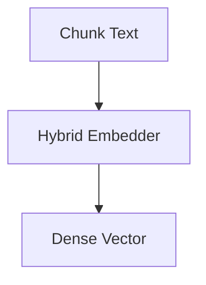

# Embeddings Module (V1.5)

## Overview

The embeddings module is responsible for loading the embedding model and generating dense vector representations for chunked text.

Version:

```text
V1.5
```

Status:

```text
Completed
```

---

## Model Configuration

Model:

```text
BAAI/bge-base-en-v1.5
```

Dimension:

```text
768
```

Normalization:

```text
Enabled
```

---

## Verification

```text
PASSED
```

---

## Sample Output

```text
==================================================
LOADING MODEL
==================================================
Warning: You are sending unauthenticated requests to the HF Hub. Please set a HF_TOKEN to enable higher rate limits and faster downloads.
Loading weights: 100% (199/199) [00:00<00:00, 7105.84it/s]
D:\hybrid-rag-mcp\embeddings\embedder.py:35: FutureWarning: The `get_sentence_embedding_dimension` method has been renamed to `get_embedding_dimension`.
  return self.model.get_sentence_embedding_dimension()
Embedding Dimension: 768

VECTOR GENERATED
Vector Length: 768
First 10 Values:
[-0.020141735672950745, -0.03856726735830307, 0.032482411712408066, 0.0007091558072715998, 0.014595510438084602, 0.014186603017151356, 0.008800528943538666, 0.006915652193129063, -0.025747139006853104, 0.03797142952680588]
```

---

## Workflow


