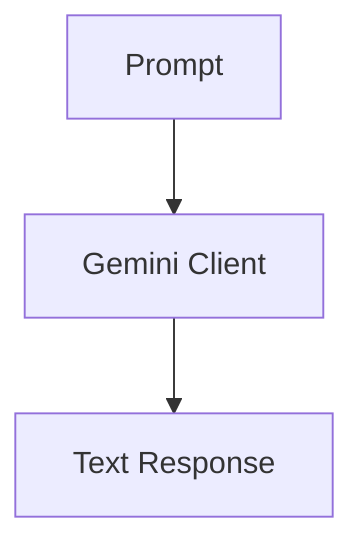

# Gemini Integration Layer (V1)

## Overview

The LLM module wraps Gemini to provide consistent text generation for RAG workflows.

---

## Workflow

## Files

* gemini_client.py

---

## Features

* Text generation
* System prompt support
* RAG support
* Environment-variable configuration
* Future multimodal support

---

## Future Roadmap

* Gemini Vision
* Image understanding
* OCR-assisted reasoning
* Multimodal RAG