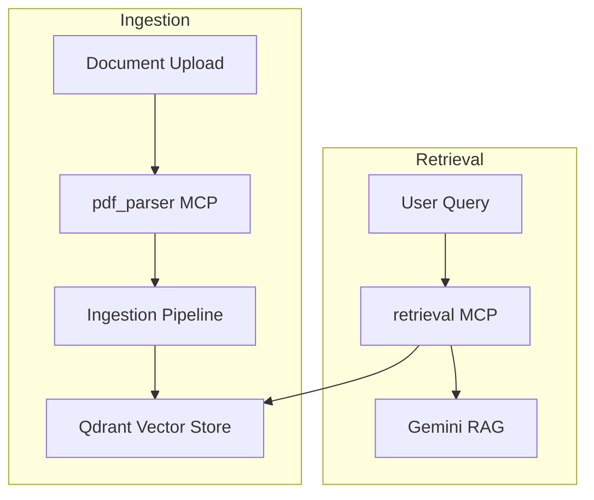

# MCP Servers Overview

This folder contains the MCP servers that make up the document intelligence pipeline.

Each server focuses on a single responsibility and exposes a small tool surface through MCP for orchestration.

## Servers

* pdf_parser
  * Status: Completed (V2)
  * Responsibilities: PDF parsing, metadata extraction, page text extraction

* retrieval
  * Status: Completed (V3)
  * Responsibilities: Semantic search, collection stats, document listing, Gemini RAG, document ingestion, document-level filtering
  * Tools: semantic_search, get_collection_stats, list_documents, ask_documents, ingest_document

* ocr
  * Status: Planned (V1)
  * Responsibilities: OCR for scanned pages

* table_extractor
  * Status: Planned (V1)
  * Responsibilities: Table detection and extraction

* layout_analyzer
  * Status: Planned (V1)
  * Responsibilities: Layout parsing and section detection

* vector_store
  * Status: Planned (V1)
  * Responsibilities: MCP access to vector store operations

---

## Server Summary

| Server | Status | Key Responsibilities |
|--------|--------|----------------------|
| pdf_parser | Completed (V2) | PDF parsing, metadata extraction, page text extraction |
| retrieval | Completed (V3) | Semantic search, collection stats, document listing, Gemini RAG, document ingestion, document-level filtering |
| ocr | Planned (V1) | OCR for scanned pages |
| table_extractor | Planned (V1) | Table detection and extraction |
| layout_analyzer | Planned (V1) | Layout parsing and section detection |
| vector_store | Planned (V1) | MCP access to vector store operations |

---

## Architecture Overview



---

## Server Details

### pdf_parser

Primary responsibilities:

* Extract page text
* Extract document text
* Extract PDF metadata

Key modules:

* server.py
* tools.py
* pdf_utils.py
* schemas.py

---

### retrieval

Primary responsibilities:

* Semantic search in Qdrant
* Gemini-powered RAG responses
* Document ingestion via MCP tooling
* Document-level filtering

Tools:

* semantic_search
* ask_documents
* ingest_document
* list_documents
* get_collection_stats

Key modules:

* server.py
* tools.py
* retrieval_engine.py
* rag_engine.py
* schemas.py

---

### ocr

Primary responsibilities:

* OCR for scanned pages

Status:

* Planned (V1)

---

### table_extractor

Primary responsibilities:

* Table detection and extraction

Status:

* Planned (V1)

---

### layout_analyzer

Primary responsibilities:

* Layout parsing and section detection

Status:

* Planned (V1)

---

### vector_store

Primary responsibilities:

* MCP access to vector store operations

Status:

* Planned (V1)

---

## Directory Layout

```text
mcp_servers/

├── pdf_parser/
├── retrieval/
├── ocr/
├── table_extractor/
├── layout_analyzer/
└── vector_store/
```

## Running Locally

Use the MCP server list in VS Code or run modules directly:

```bash
uv run python -m mcp_servers.pdf_parser.server
uv run python -m mcp_servers.retrieval.server
```

---

## Notes

* Use MCP Inspector to discover tools and validate MCP metadata.
* Retrieval MCP supports optional document filters via `document_name`.
