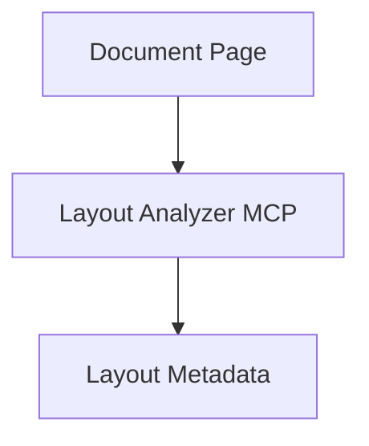

# Layout Analyzer MCP (V1)

## Overview

Layout Analyzer MCP is responsible for extracting layout-level structure from documents, such as headings, sections, and reading order.

Version:

```text
V1
```

Status:

```text
Planned
```

---

# Responsibilities

* Detect headings and sections
* Identify multi-column layouts
* Preserve reading order
* Emit layout metadata for downstream tools

---

# Planned Workflow



# Planned Tools

* extract_layout
* extract_sections
* extract_document_structure
