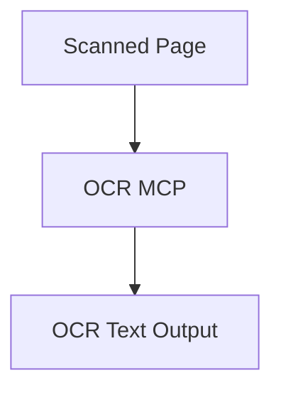

# OCR MCP (V1)

## Overview

OCR MCP extracts text from scanned or image-based document pages.

Version:

```text
V1
```

Status:

```text
Planned
```

---

# Responsibilities

* Detect image-only pages
* Perform OCR
* Return page-level OCR text

---

# Planned Workflow



# Planned Tools

* extract_ocr_text
* extract_ocr_page
