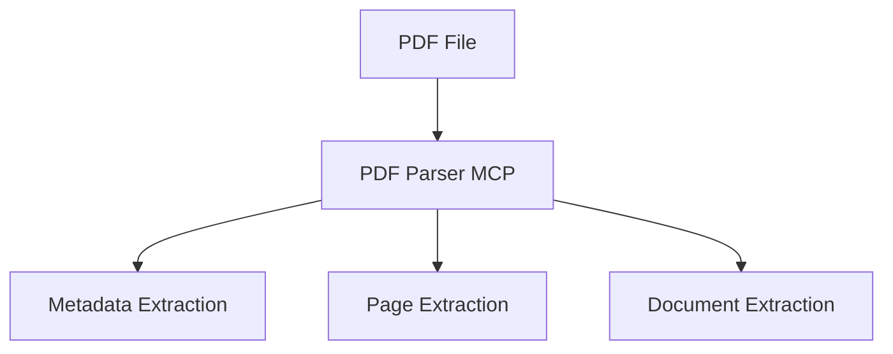

# PDF Parser MCP

## V1 (Archived)

### Overview

PDF Parser MCP is the first Model Context Protocol (MCP) server developed as part of the Hybrid PDF + OCR Retrieval Pipeline.

The purpose of this server is to provide foundational PDF document processing capabilities by exposing document extraction functionality through MCP tools.

This server acts as the entry point of the document ingestion pipeline and is responsible for reading PDF files, extracting metadata, retrieving page-level content, and returning full document text.

Version:

```text
V1
```

Status:

```text
Completed
```

---

### Responsibilities

The PDF Parser MCP server is responsible for:

* Opening PDF documents
* Extracting document metadata
* Extracting page-level text
* Extracting full document text
* Returning structured responses through MCP tools

The server does not perform:

* OCR
* Table extraction
* Embedding generation
* Vector storage
* Semantic retrieval
* LLM inference

These capabilities will be implemented in separate MCP servers.

---

### Architecture

```text
PDF File
  |
  v
PDF Parser MCP
  |
  +-------------------+
  |        |          |
  v        v          v
Metadata  Page       Document
Extraction Extraction Extraction
```

#### Architecture (Visual)



---

### Technology Stack

Framework:

```text
MCP Python SDK
FastMCP
```

PDF Processing:

```text
PyMuPDF
```

Validation:

```text
Pydantic
```

Development Environment:

```text
VS Code
UV
Docker Desktop
```

---

### Implemented Tools

#### parse_pdf_tool

Purpose:

Returns a high-level summary of a PDF document.

Input:

```json
{
  "file_path": "data/samples/sample.pdf"
}
```

Output:

```json
{
  "document_name": "sample.pdf",
  "page_count": 10,
  "total_characters": 25430
}
```

---

#### get_pdf_metadata_tool

Purpose:

Extract PDF metadata.

Input:

```json
{
  "file_path": "data/samples/sample.pdf"
}
```

Output:

```json
{
  "title": "Document Title",
  "author": "Author Name",
  "pages": 10
}
```

---

#### extract_page_tool

Purpose:

Extract text from a specific page.

Input:

```json
{
  "file_path": "data/samples/sample.pdf",
  "page_number": 1
}
```

Output:

```json
{
  "page_number": 1,
  "content": "Extracted page text..."
}
```

---

#### extract_document_text_tool

Purpose:

Extract text from all pages.

Input:

```json
{
  "file_path": "data/samples/sample.pdf"
}
```

Output:

```json
{
  "pages": [
    {
      "page_number": 1,
      "content": "..."
    }
  ]
}
```

---

### Project Structure

```text
pdf_parser/

├── __init__.py
├── server.py
├── tools.py
├── schemas.py
├── pdf_utils.py
└── README.md
```

---

### Verification

#### MCP Inspector

Connection Method:

```text
STDIO
```

Command:

```bash
uv
```

Arguments:

```bash
run python -m mcp_servers.pdf_parser.server
```

---

#### Tool Discovery

Status:

```text
PASSED
```

Detected Tools:

```text
parse_pdf_tool
get_pdf_metadata_tool
extract_page_tool
extract_document_text_tool
```

---

#### PDF Summary Extraction

Status:

```text
PASSED
```

Result:

```text
Document information successfully extracted.
```

---

#### Metadata Extraction

Status:

```text
PASSED
```

Result:

```text
Metadata successfully extracted.
```

---

#### Page Extraction

Status:

```text
PASSED
```

Result:

```text
Page-level extraction successfully completed.
```

---

#### Full Document Extraction

Status:

```text
PASSED
```

Result:

```text
Full document text successfully extracted.
```

---

### Challenges Encountered

#### Tool Input Formatting

Issue:

```text
MCP Inspector initially passed JSON input incorrectly.
```

Resolution:

```text
Tool input structure was corrected and validated.
```

---

### Deliverables

Completed:

* MCP Server Setup
* Tool Registration
* PDF Metadata Extraction
* Page Extraction
* Full Document Extraction
* MCP Inspector Validation

---

### Current Limitations

Current version does not support:

* OCR
* Scanned PDFs
* Table extraction
* Layout analysis
* Chunk generation
* Vector storage

---

### Status

```text
Version: V1
Status: Stable
Verification: Passed
```

---

## V2 (Current)

### Overview

V2 integrates the PDF parser with the ingestion pipeline and downstream vector storage while keeping the parser focused on extraction tasks.

Version:

```text
V2
```

Status:

```text
Completed
```

---

### Completed Enhancements

* Integrated with Ingestion Pipeline
* Hybrid Chunking Support
* Embedding Preparation
* Metadata Enrichment
* Qdrant Integration Support

---

### Current Flow

```text
PDF Parser MCP
  |
  v
Ingestion Pipeline
  |
  v
Hybrid Chunker
  |
  v
Hybrid Embedder
  |
  v
Qdrant
```

---

### Metadata Enrichment Status

Current payload:

```json
{
  "document_name": "sample.pdf",
  "page": 1,
  "chunk_id": "chunk_0001",
  "chunk_type": "base",
  "content_type": "text"
}
```

Planned metadata fields:

```json
{
  "section": "...",
  "source": "pdf",
  "ingestion_timestamp": "...",
  "document_type": "..."
}
```

Requires:

* Layout MCP
* Section detection

---

### Project Status

```text
PDF Parser MCP V2              DONE
Hybrid Chunking                DONE
Hybrid Embedder                DONE
Qdrant Vector Store            DONE
Document Ingestion Pipeline    DONE
Retrieval MCP                  DONE
OCR MCP                        NEXT
Table Extraction MCP           NEXT
Layout Analysis MCP            NEXT
```

---

## V3 (Planned)

### Theme

Layout-Aware Parsing

### Features

* Heading detection
* Multi-column parsing
* Section extraction
* Page layout metadata
* Reading order preservation

### Planned Tools

* extract_layout()
* extract_sections()
* extract_document_structure()
