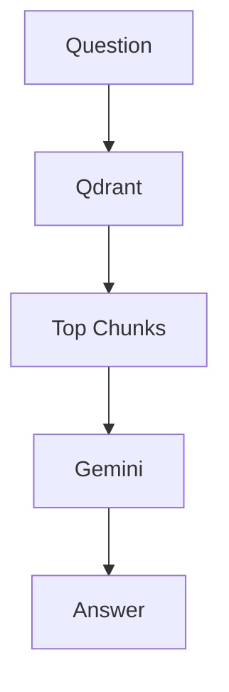
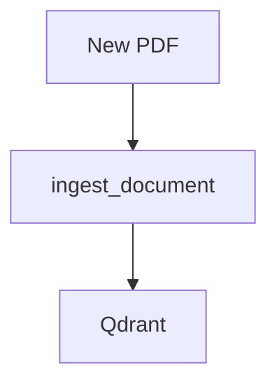

# Retrieval MCP (V3)

## Overview

Retrieval MCP exposes semantic search and Gemini-powered RAG over stored document chunks, plus document ingestion via MCP tooling.

Version:

```text
V3
```

Status:

```text
Completed
```

---

# Responsibilities

* Accept a user query
* Search the vector store
* Return ranked chunks with metadata
* Run Gemini-powered question answering
* Ingest new documents into Qdrant

---

# Architecture

## Query Flow



## Ingestion Flow



---

# Components

## retrieval_engine.py

Responsibilities:

* Execute vector search
* Return scored results

---

## rag_engine.py

Responsibilities:

* Build context from top K chunks
* Generate grounded answers via Gemini
* Return citations with source metadata

---

## tools.py

Responsibilities:

* Provide MCP tool wrappers
* Validate and format responses
* Connect to ingestion service

---

## schemas.py

Responsibilities:

* Define request and response models
* Standardize payloads

---

# Tools

## semantic_search

Input:

```json
{
  "query": "revenue growth",
  "top_k": 5
}
```

Output:

```json
{
  "results": [
    {
      "document_name": "sample.pdf",
      "page": 1,
      "chunk_id": "chunk_0001",
      "chunk_type": "base",
      "content_type": "text",
      "chunk_text": "...",
      "score": 0.86
    }
  ]
}
```

---

## get_collection_stats

Returns collection stats for the documents collection.

Output:

```json
{
  "collection_name": "documents",
  "points_count": 40,
  "vector_dimension": 768,
  "distance_metric": "COSINE"
}
```

---

## list_documents

Lists unique document names currently stored.

Output:

```json
{
  "documents": [
    "sample.pdf"
  ]
}
```

---

## ask_documents

Runs Gemini-powered RAG over the top K chunks.

Input:

```json
{
  "query": "What is the research gap?",
  "top_k": 8
}
```

Output:

```json
{
  "answer": "...",
  "sources": [
    {
      "document_name": "sample.pdf",
      "page": 9,
      "score": 0.48,
      "snippet": "..."
    }
  ]
}
```

---

## ingest_document

Ingests a new document into Qdrant via the ingestion pipeline.

Input:

```json
{
  "file_path": "data/samples/sample.pdf"
}
```

Output:

```json
{
  "status": "success",
  "document_name": "sample.pdf",
  "file_type": ".pdf",
  "details": {
    "pages": 19,
    "chunks": 40,
    "vectors": 40
  }
}
```

---

# Schemas

## RetrievalRequest

```json
{
  "query": "...",
  "top_k": 5
}
```

## RetrievalResult

```json
{
  "document_name": "sample.pdf",
  "page": 1,
  "chunk_id": "chunk_0001",
  "chunk_type": "base",
  "content_type": "text",
  "chunk_text": "...",
  "score": 0.86
}
```

## RetrievalResponse

```json
{
  "results": [
    {
      "document_name": "sample.pdf",
      "page": 1,
      "chunk_id": "chunk_0001",
      "chunk_type": "base",
      "content_type": "text",
      "chunk_text": "...",
      "score": 0.86
    }
  ]
}
```

---

# Verification

* MCP Inspector
* Semantic Search
* Gemini Integration
* Source Attribution
* Document Ingestion

---

# Future Roadmap

* Hybrid retrieval (dense + sparse)
* Reranking
* Multimodal retrieval