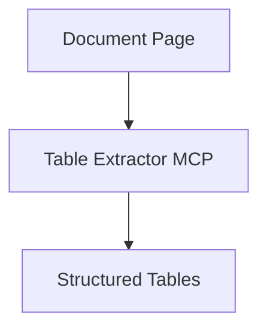

# Table Extractor MCP (V1)

## Overview

Table Extractor MCP extracts structured tables from documents and returns rows, columns, and headers.

Version:

```text
V1
```

Status:

```text
Planned
```

---

# Responsibilities

* Detect tables
* Extract rows and columns
* Preserve headers and cell relationships

---

# Planned Workflow



# Planned Tools

* extract_tables
* extract_table_page
