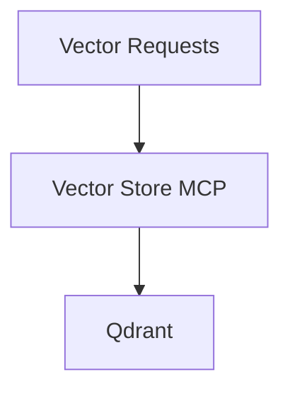

# Vector Store MCP (V1)

## Overview

Vector Store MCP will provide MCP-accessible operations over the vector database (Qdrant).

Version:

```text
V1
```

Status:

```text
Planned
```

---

# Responsibilities

* List collections
* Get collection stats
* Insert points
* Query vectors

---

# Planned Workflow



# Planned Tools

* list_collections
* get_collection_stats
* upsert_points
* query_points
