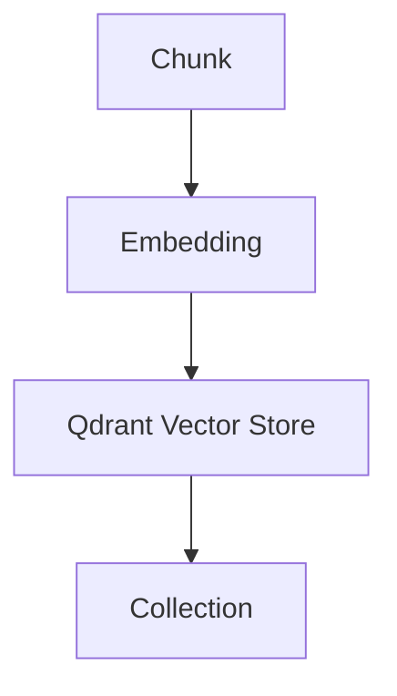

# Qdrant Vector Store

## V1 (Archived)

### Overview

The Vector Store layer is responsible for persisting embeddings generated during the ingestion process and enabling future semantic retrieval operations.

This implementation uses a locally hosted Qdrant instance running through Docker.

The vector store acts as the knowledge repository for the entire document intelligence system.

Version:

```text
V1
```

Status:

```text
Completed
```

---

### Objectives

* Establish connection with Qdrant
* Create and manage vector collections
* Store embeddings and metadata
* Enable future semantic search workflows
* Support scalable document ingestion

---

### Architecture

```text
Chunk
	|
	v
Embedding
	|
	v
Qdrant Vector Store
	|
	v
Collection
```

#### Architecture (Visual)



---

### Technology Stack

Vector Database:

```text
Qdrant
```

Deployment:

```text
Docker Desktop
```

Client:

```text
qdrant-client
```

---

### Components

#### qdrant_client.py

Responsibilities:

* Establish connection
* Manage Qdrant client lifecycle

---

#### collections.py

Responsibilities:

* Create collections
* List collections
* Manage vector schemas

---

#### ingest.py

Responsibilities:

* Generate vector payloads
* Store vectors in Qdrant
* Associate metadata with vectors

---

### Collection Configuration

Collection Name:

```text
documents
```

Vector Size:

```text
768
```

Distance Metric:

```text
COSINE
```

---

### Payload Structure (V1)

```json
{
	"document_name": "sample.pdf",
	"chunk_text": "...",
	"chunk_type": "base",
	"content_type": "text"
}
```

---

### Verification

#### Qdrant Connection

Status:

```text
PASSED
```

Result:

Successfully connected to local Qdrant instance.

---

#### Collection Creation

Status:

```text
PASSED
```

Result:

documents collection created successfully.

---

#### Collection Discovery

Status:

```text
PASSED
```

Result:

Collection listed successfully.

---

#### Vector Ingestion

Status:

```text
PASSED
```

Result:

Embeddings stored successfully.

---

### Verification Scripts

```text
tests/test_qdrant_connection.py
tests/test_create_collection.py
tests/test_list_collections.py
tests/test_ingest.py
```

---

### Future Payload Versions

#### V2

```json
{
	"document_name": "...",
	"page": 1,
	"chunk_id": "...",
	"chunk_text": "..."
}
```

---

#### V3

```json
{
	"document_name": "...",
	"page": 1,
	"section": "...",
	"chunk_type": "...",
	"content_type": "..."
}
```

---

#### V4

Support:

* OCR chunks
* Table chunks
* Layout-aware metadata

---

### Deliverables

Completed:

* Qdrant setup
* Collection management
* Vector ingestion
* Metadata payload support
* Verification testing

---

## V1.5 (Current)

### Overview

V1.5 standardizes payload metadata to include page, chunk identifiers, and content types for downstream MCP services.

Version:

```text
V1.5
```

Status:

```text
Completed
```

---

### Payload Structure (V1.5)

```json
{
	"document_name": "sample.pdf",
	"page": 1,
	"chunk_id": "chunk_0001",
	"chunk_type": "base",
	"content_type": "text",
	"chunk_text": "..."
}
```

---

### Collection Summary

Collection Name:

```text
documents
```

Vector Dimension:

```text
768
```

Distance Metric:

```text
COSINE
```

Stored Points:

```text
40+
```

---

# Status

Version: V1

Status: Stable

Verification: Passed
